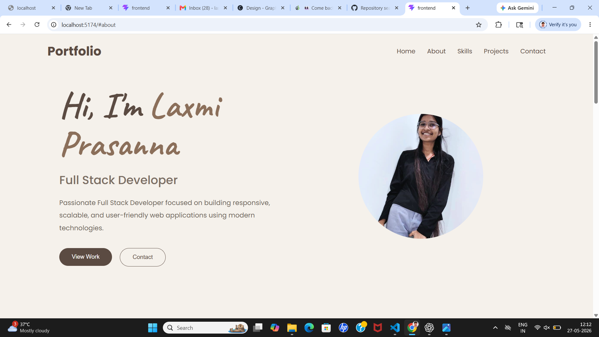
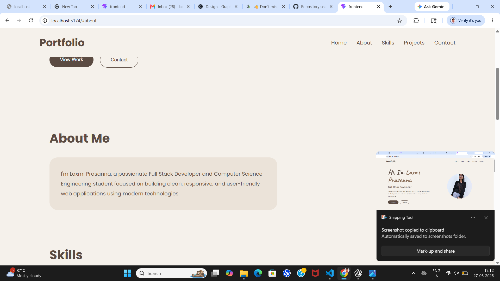
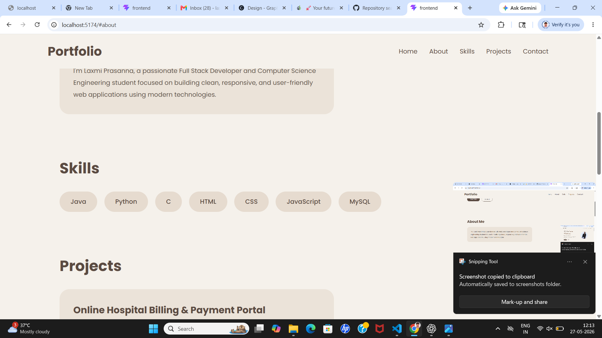
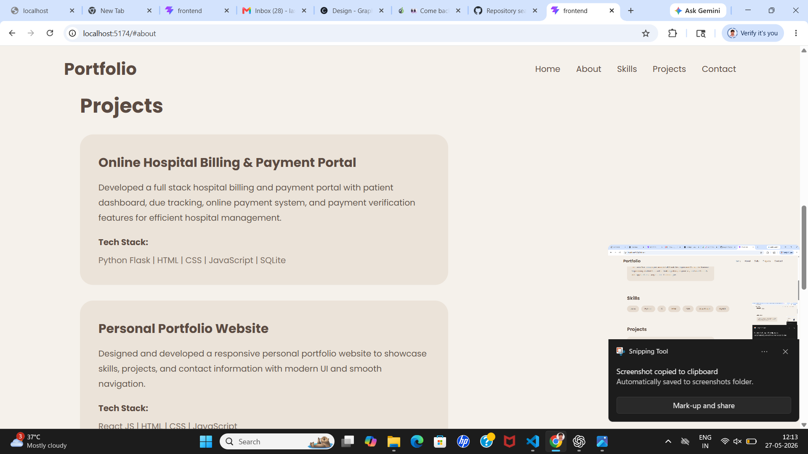
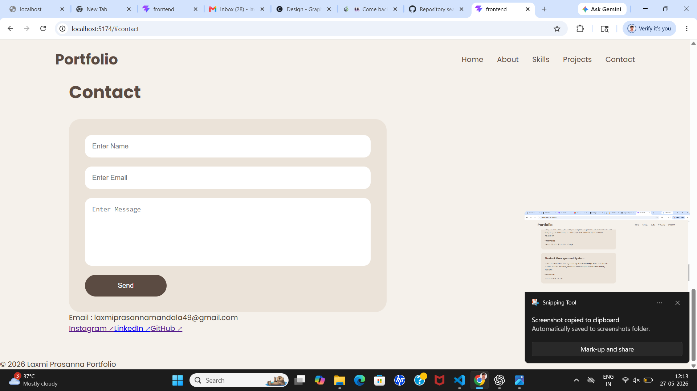

# FUTURE_FS_01

## Full Stack Portfolio Website

This project is a personal portfolio website developed as part of the Full Stack Web Development Internship Task.

## Features
- Responsive Portfolio Design
- About Section
- Skills Section
- Projects Section
- Interactive Contact Form
- Email Notifications using EmailJS
- Social Media Links

## Technologies Used

### Frontend
- React.js
- HTML
- CSS
- JavaScript
- Vite

### Backend
- Node.js
- Express.js

## Contact Feature
The portfolio includes a contact form integrated with EmailJS, allowing visitors to send messages directly through the website with email notifications.

## Project Structure

```bash
frontend/
backend/
screenshots/
```

## Screenshots

### Home


### About


### Skills


### Projects


### Contact


## Author
Laxmi Prasanna
